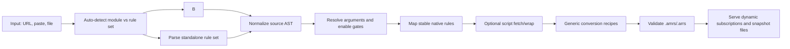

# Architecture

The converter is split into small runtime-neutral entry points instead of a monolithic Worker.

## Files

| File | Role |
| --- | --- |
| `src/core.mjs` | Parser, normalization, rule mapping, emitter, validator, script wrapper. |
| `bin/cli.mjs` | Local command-line entry point. |
| `src/worker.mjs` | Cloudflare Worker API, source fetching, KV persistence, rule serving. |
| `src/ui.mjs` | Worker browser UI rendering. |
| `test/core.test.mjs` | Node test suite for parser/emitter/mapping behavior. |

## Pipeline

## Conversion Modes

| Mode | Default | Behavior |
| --- | --- | --- |
| `compat` | yes | Downloads remote scripts by default, lifts high-confidence JavaScript patterns including static URL-guarded JSON mutations, wraps common Loon/Surge APIs, and merges same-phase scripts into gated dispatchers. Output is usually `partial` or `sample-required`. |
| `aggressive` | no | Starts from `compat`, then additionally lifts selected assumption-heavy JSON cleanup idioms such as array `splice(0)` clears. It does not native-lift protobuf, binary, dynamic code, helper-function mutation, or external HTTP-driven transformations. |

The Worker UI exposes a standard conversion path backed by `compat` with remote script fetching enabled, plus an opt-in "增强 JS 原生化" switch for `aggressive`.

See [Conversion Modes](conversion-modes.md) for the detailed `compat` / `aggressive` behavior boundary.

## Worker Link Model

URL-based conversions return dynamic subscription links by default:

- `/sub/mitm.amrs?url=<module-url>`
- `/sub/reject.arrs?url=<module-url>`
- `/sub/direct.arrs?url=<module-url>`
- `/sub/rule.arrs?url=<module-url>`
- `/sub/deeplink?url=<module-url>`

These links preserve the original module or rule-set URL in the subscription, so Anywhere can receive updated conversion output after upstream content changes and the Worker cache expires. Standalone rule sets can include `sourceKind=ruleset` and `ruleSetRouting=default|direct|reject` in the query when the source has no embedded policy action. URL-based conversions do not generate hashes. The API only emits hash-backed `/r/:hash/*` snapshot links when the input cannot be represented as a public dynamic subscription, such as paste-only input or conversions that depend on manual `scriptTextByURL` recovery.

## Known Boundaries

- Anywhere has one buffered script per matching message; same-gate scripts are composed, and same-phase script rules are merged into gated dispatchers.
- Request scripts cannot directly mutate URL, method, or headers. Those must be lifted to native rewrite/header rules.
- Protobuf/binary scripts can be preserved, but schema-level equivalence requires samples and endpoint-specific recipes.
- `DOMAIN` exact semantics cannot be represented in Anywhere routing; it is emitted as suffix with diagnostics.
